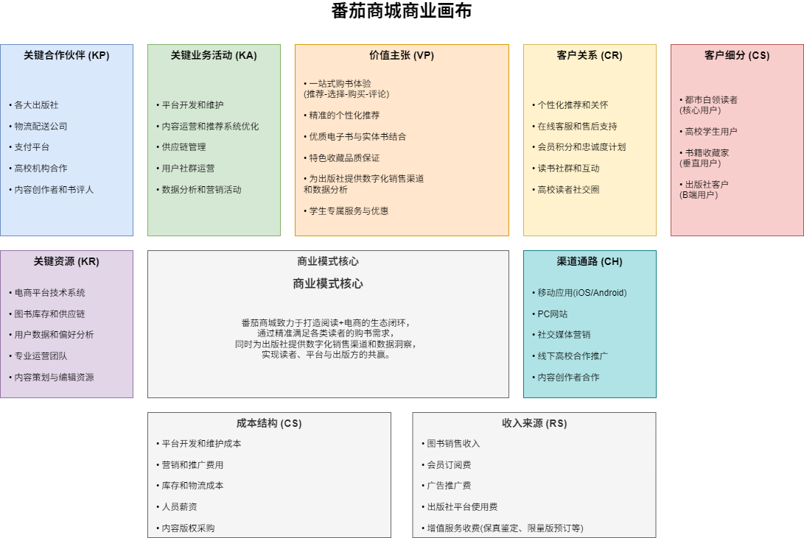
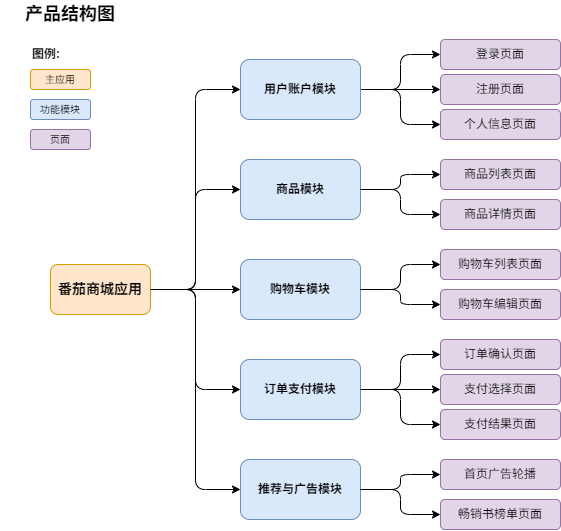
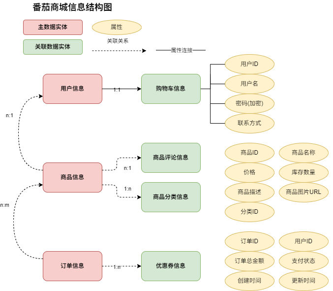
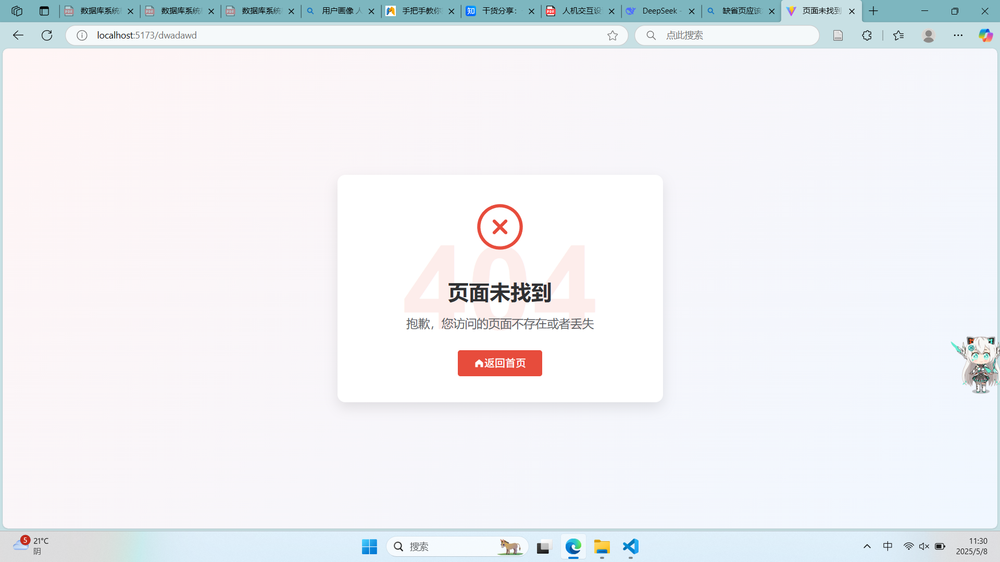

# Lab5-人机交互设计文档

## 文档作者

**主要编写者**：
张耀宇
**其他编写者**：
周林辉、陈展、贾亦宸
## 文档修改历史

| 版本号 | 修改日期 | 修改人 | 修改内容描述 |
| ------ | -------- | ------ | ------------ |
| v0.1   | 2025.4.26 |  张耀宇      | 初稿创建     |
| v0.2   | 2025.4.29 |  张耀宇      | 绘制插图     |
| v0.3   | 2025.5.8 |  张耀宇      | 完善文档的文字内容     |

## 目录
[TOC]

## 设计背景/思路
<!-- 根据实际工作需要，放置一些关于思路整理、灵感来源的文档，比如用户画像、竞品分析报告、商业画布等等。 -->
- 近年来，随着实体书相关出版技术的升级和周边文化的蓬勃发展，实体书市场逐渐复苏和实现**文化消费升级**、实体书籍的收藏需求增加。与此同时，消费者仍然面对线下购书渠道有限，难以快速获取小众书籍、符合需求的个性化书籍的痛点。本团队计划开发一个线上购书平台——**番茄读书**，拟通过线上商城打造“**阅读+电商**”生态闭环，同时为出版社提供数字化销售渠道。
- 为满足读者对便捷购书、精准推荐和互动体验的需求，同时为出版社提供高效的销售平台，番茄读书的线上商城将提供一个全新的展示与销售渠道，助力优质书籍触达更广泛的读者群体，推动文化市场的繁荣发展。

### 用户画像
<!-- *在这里描述目标用户的特征、需求和行为模式* -->
#### 都市白领读者（核心用户）

| 分类 | 详情 |
|------|------|
| **基本信息** | • 年龄：25-35岁 • 职业：互联网/金融/教育行业从业者 • 地区：一二线城市 • 收入：月薪8k-20k • 设备偏好：iOS/Android移动端+PC端 |
| **使用场景** | • 通勤路上通过手机浏览新书推荐 • 周末在家用Pad深度阅读书籍详情页 • 工作间隙在PC端批量采购团队用书 |
| **核心需求** | • 快速获取职场技能/心理自助类新书信息 • 希望获得个性化推荐减少筛选时间 • 需要发票功能和批量采购流程 |
| **行为特征** | • 月均购书频次：2-3次 • 偏好交互：收藏夹比价、心愿单共享 • 痛点多发环节：退换货流程复杂、电子发票开具慢 |

#### 高校学生用户

| 分类 | 详情 |
|------|------|
| **基本信息** | • 年龄：18-24岁 • 身份：人文社科类专业学生 • 设备使用：90%移动端 • 活跃时段：20:00-23:00 |
| **核心场景** | • 学期初采购教材教辅 • 参与读书社群打卡活动 • 二手教材置换交易 |
| **关键需求** | • 学生认证专属折扣 • 教材版本比对功能 • 读书笔记社交分享 |
| **行为画像** | • 价格敏感度高，常使用比价插件 • 依赖用户评价（特别是差评） • 容易被限时优惠/拼团活动转化 |

#### 书籍收藏家（垂直用户）

| 分类 | 详情 |
|------|------|
| **用户特征** | • 年龄跨度大（30-55岁） • 收藏方向：绝版书/签名本/特殊装帧 • 年均消费：5w+ • 设备特点：偏好大屏设备查看细节 |
| **核心诉求** | • 稀缺书籍预警通知 • 藏品品相分级标准 • 收藏圈层社交功能 |
| **行为模式** | • 每周登录3次以上查看上新 • 愿意支付溢价保障服务（保真鉴定） • 高频率使用高级搜索（ISBN精确检索） |

#### 出版社客户（B端用户）

| 分类 | 详情 |
|------|------|
| **机构画像** | • 类型：中小型专业出版社 • 需求：数字化渠道+数据反馈 • 关键决策人：发行部主管 |
| **核心需求** | • 实时销售数据看板 • 读者评论情感分析 • 精准库存预警系统 |
| **交互特性** | • 需要多账户分级权限管理 • 重视API对接现有ERP系统 • 倾向使用桌面端进行运营管理 |
### 竞品分析

<!-- *分析市场上类似产品的优缺点* -->
| 竞品名称 | 优点 | 缺点 |
|---------|-------|-----|
| 当当网 |专注图书业务、自营质量保证 | 平台设计老旧，自营以外的商店质量参差 |
| 淘宝网 | 综合品类多、商品全 | 没有特定的书籍推荐与管理 |
| 新华书店网上商城 | 对接出版社，书籍质量高 | 定价较高，物流不便 |

### 商业画布

### 设计理念

<!-- *描述产品设计的核心理念和价值主张* -->
- 核心理念：给用户推荐——选择——购买——评论一站式的购书体验
- 价值主张：简洁、高效、质量、个性

## 业务流程

<!-- 业务流程图，不同于操作流程图和页面流程图，它是产品的整体业务流程，通常用泳道图的形式展示。在本项目中，买家购物由始至终的流程就是它的业务流程。

*插入业务流程泳道图* -->

## 页面交互

### 产品结构、信息结构

<!-- 以树状图的形式，从两个不同的维度来梳理产品。 -->

#### 产品结构图
<!-- 
*插入产品结构树状图，梳理产品功能点，列举产品包含的功能模块及各模块下的页面* -->

#### 信息结构图

<!-- *插入信息结构图，梳理具体页面显示的动态信息内容* -->

### 操作流程图

<!-- 为每个功能模块绘制操作流程图，用于确定产品功能设计逻辑。 -->

#### 用户账户模块操作流程

#### 商品展示模块操作流程

#### 购物车模块操作流程

#### 订单支付模块操作流程

### 原型图

<!-- 使用墨刀或Axure等工具绘制页面原型图，形成产品模型。
以下是使用优惠券进行支付的界面或弹窗原型:

*插入优惠券支付界面/弹窗原型图* -->

## 全局通用说明

### 常用控件

| 控件类型 | 样式描述 | 交互说明 | 示例图 |
| -------- | -------- | -------- | ------ |
| 按钮     |el-button | 点击按钮 |        |
| 列表框   |el-table | 上下滑动 |        |
| 导航栏   |el-menu | 点击菜单项切换|        |
### 复用界面/组件

| 组件名称 | 使用场景 | 交互说明 | 示例图 |
| -------- | -------- | -------- | ------ |
| Header | 顶部菜单栏 |点击切换页面 |        |
### 单位规范

| 信息类型 | 显示规范 | 示例 |
| -------- | -------- | ---- |
| 时间     | 刚刚、m分钟前、h小时前、昨天hh:mm、年/月/日 hh:mm | 5分钟前 |
| 金额     | ¥xx.xx，不显示小数点后多余的0 | ¥99.9 |
| 数量     | 超过一万时显示x.x万，超过一亿时显示x.x亿 | 1.2万 |

### 缺省页汇总
#### 页面错误缺省页

<!-- | 缺省类型 | 使用场景 | 样式描述 | 示例图 |
| -------- | -------- | -------- | ------ |
| 加载中   |          |          |        |
| 网络错误 |          |          |        |
| 无数据   |          |          |        |
| 权限受限 |          |          |        | -->

## 废纸篓

<!-- *放置修改时删除的一些页面，避免到最后用回以前的方案时重新再做浪费时间* -->

---