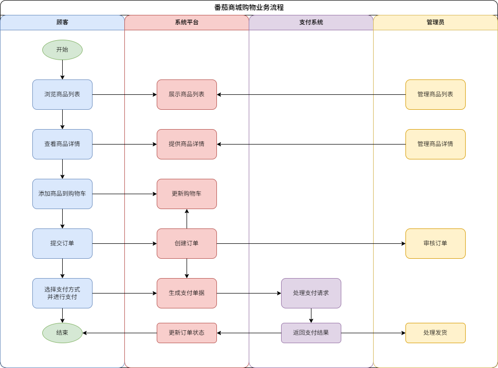
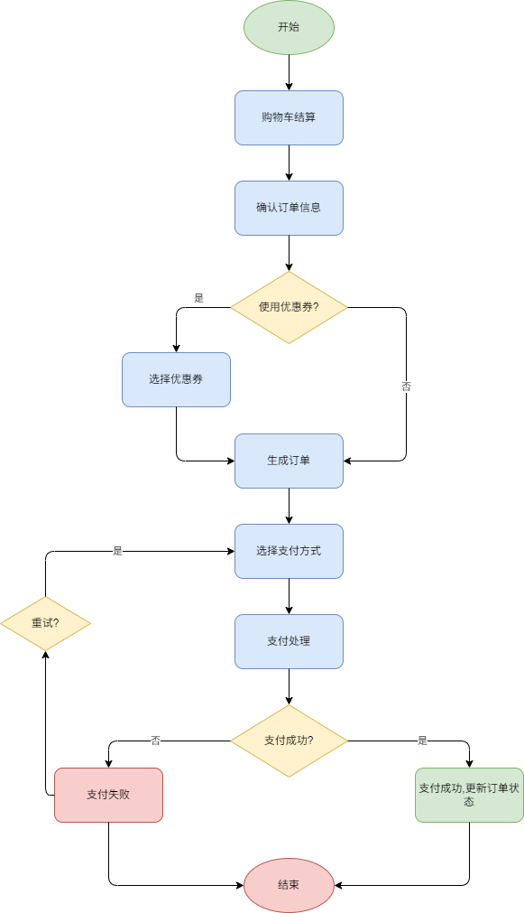
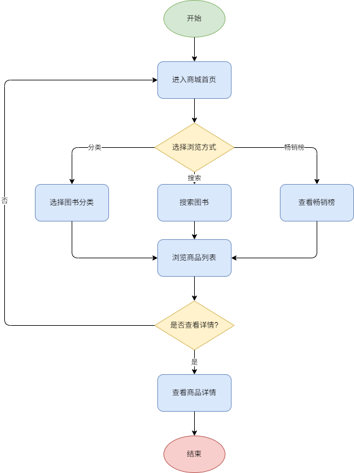
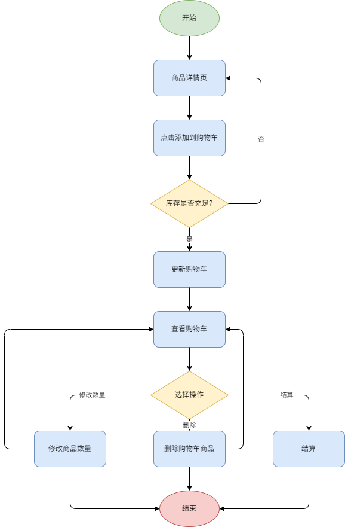

# Lab5-人机交互设计文档

## 文档作者

**主要编写者**：
张耀宇
**其他编写者**：
周林辉、陈展、贾亦宸
## 文档修改历史

| 版本号 | 修改日期 | 修改人 | 修改内容描述 |
| ------ | -------- | ------ | ------------ |
| v0.1   | 2025.4.26 |  张耀宇      | 初稿创建     |
| v0.2   | 2025.4.29 |  张耀宇      | 绘制插图     |

## 目录
[TOC]

## 设计背景/思路

根据实际工作需要，放置一些关于思路整理、灵感来源的文档，比如用户画像、竞品分析报告、商业画布等等。

### 用户画像

*在这里描述目标用户的特征、需求和行为模式*

### 竞品分析

*分析市场上类似产品的优缺点*

### 设计理念

*描述产品设计的核心理念和价值主张*

## 业务流程

<!-- 业务流程图，不同于操作流程图和页面流程图，它是产品的整体业务流程，通常用泳道图的形式展示。在本项目中，买家购物由始至终的流程就是它的业务流程。

*插入业务流程泳道图* -->

## 页面交互

### 产品结构、信息结构

以树状图的形式，从两个不同的维度来梳理产品。

#### 产品结构图

*插入产品结构树状图，梳理产品功能点，列举产品包含的功能模块及各模块下的页面*

#### 信息结构图

*插入信息结构图，梳理具体页面显示的动态信息内容*

### 操作流程图

为每个功能模块绘制操作流程图，用于确定产品功能设计逻辑。

#### 用户账户模块操作流程

#### 商品展示模块操作流程

#### 购物车模块操作流程

#### 订单支付模块操作流程

### 原型图

使用墨刀或Axure等工具绘制页面原型图，形成产品模型。
以下是使用优惠券进行支付的界面或弹窗原型:

*插入优惠券支付界面/弹窗原型图*

## 全局通用说明

整个产品可通用或者复用的元素。

### 常用控件

| 控件类型 | 样式描述 | 交互说明 | 示例图 |
| -------- | -------- | -------- | ------ |
| 按钮     |          |          |        |
| 列表框   |          |          |        |
| 导航栏   |          |          |        |
| 标签栏   |          |          |        |

### 复用界面/组件

| 组件名称 | 使用场景 | 交互说明 | 示例图 |
| -------- | -------- | -------- | ------ |
|          |          |          |        |
|          |          |          |        |

### 单位规范

| 信息类型 | 显示规范 | 示例 |
| -------- | -------- | ---- |
| 时间     | 刚刚、m分钟前、h小时前、昨天hh:mm、年/月/日 hh:mm | 5分钟前 |
| 金额     | ¥xx.xx，不显示小数点后多余的0 | ¥99.9 |
| 数量     | 超过一万时显示x.x万，超过一亿时显示x.x亿 | 1.2万 |

### 缺省页汇总

| 缺省类型 | 使用场景 | 样式描述 | 示例图 |
| -------- | -------- | -------- | ------ |
| 加载中   |          |          |        |
| 网络错误 |          |          |        |
| 无数据   |          |          |        |
| 权限受限 |          |          |        |

## 废纸篓

*放置修改时删除的一些页面，避免到最后用回以前的方案时重新再做浪费时间*

---

注：本模板可根据实际项目需求进行适当调整和扩展。