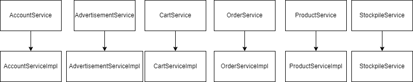
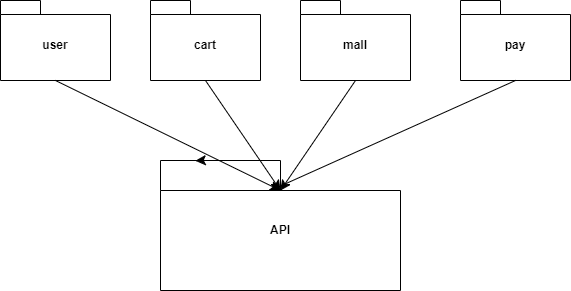
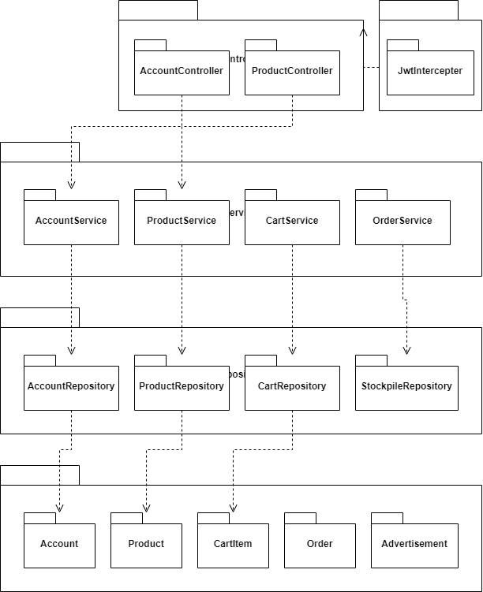
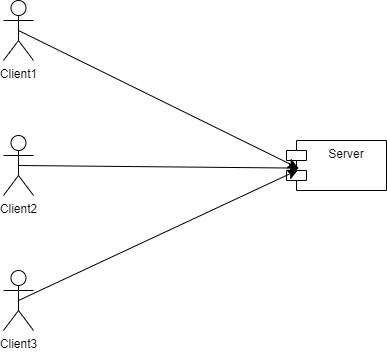
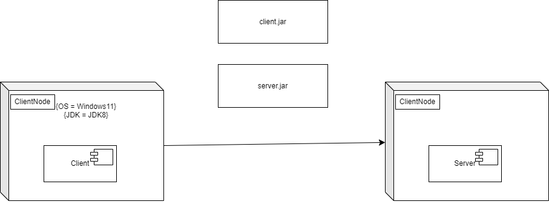
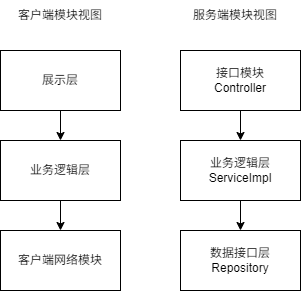

# lab4-软件体系结构设计文档

## 文档修改历史

| 修改人员 | 日期      | 修改原因                                                     | 版本号 |
| -------- | --------- | ------------------------------------------------------------ | ------ |
| 贾亦宸   | 2025.4.20 | 根据已开发的功能完成软件体系结构设计整体框架文档的完善 | V1.0   |
| 张耀宇   | 2025.5.5 | 补充了缺失图表，完善了体系结构设计文档的插图展示和排版结构 | V1.1   |

## 1 引言

### 1.1 编制目的

本报告详细完成对番茄书城的概要设计，达到指导详细设计和开发的目的，同时实现和测试人员及用户的沟通。

本报告面向开发人员、测试人员及最终用户而编写，是了解系统的导航。

### 1.2 词汇表

| 词汇名称 | 词汇含义 | 备注   |
|----|----|----|
| ServiceImpl | Service Implementation | 接口的具体实现 |
| oss     | object Storage Service     |      |对象存储服务 |
| Dao     | data access object|数据访问层|
|Controller|控制器|业务模块流程控制|

### 1.3 参考资料

(1)《软件工程与计算（卷二） 软件开发的技术基础》丁二玉、刘钦著

(2)IEEE标准

(3)Tomato-mall用例文档

(4)Tomato-mall项目启动文档

## 2 产品概述

此部分请参考Tomata-mall用例文档和软件需求规格说明中对产品的概括描述。

## 3 逻辑视图

在本系统中，选择了分层体系结构风格，将系统分为三部分（presentation, businesslogic, data），从而达到很好地示意整个高层抽象的效果。其中Presentation部分包含了GUI页面的实现，business部分负责接受前端发送的请求并分发给相应的接口来进行业务逻辑的实现，data部分负责数据的持久化和访问。分层体系结构的逻辑视角和逻辑设计方案如下图所示。

## 4 组合视角

### 4.1 开发包图

| 开发（物理）包                      | 依赖的其它开发包                                                                                                                                                 |
|------------------------------|----------------------------------------------------------------------------------------------------------------------------------------------------------|
|user.ts (用户API)|utils/request.ts|
|cart.ts (购物车API)|utils/request.ts|
|mall.ts (商城API)|utils/request.ts|
|utils/request.ts|axios库|
|AccountController|AccountService接口, UserVO/DTO|
|CartController|CartService接口, CartVO/DTO|
|ProductController|ProductService接口, ProductVO/DTO|
|AccountServiceImpl|AccountService接口, AccountRepository, UserEntity|
|CartServiceImpl|CartService接口, CartRepository, CartEntity, ProductRepository|
|ProductServiceImpl|ProductService接口, ProductRepository, ProductEntity|
|AccountRepository|AccountEntity, JpaRepository|
|CartRepository|CartEntity, JpaRepository|
|ProductRepository|ProductEntity, JpaRepository|
|api|/|
|router|/|
|po|/|
|vo|/|
|OssUtil|/|
|Jwtintercepter|/|
|enums|/|

#### 客户端开发包图

#### 服务端开发包图

### 4.2 运行时进程

### 4.3 物理部署

- 处理如何将软件组件映射到硬件设施
- 部署图:

## 5 接口视角

- 描述功能分解和如何在不同的层中安排软件模块
  - 描述架构中的对象，包含架构图
  - 描述组件接口信息
    - 包含：语法、前置条件、后置条件

### 5.1 模块职责

客户端模块和服务端模块视图分别如图6和图7所示。客户端各层和服务端各层职责分别如表1和表2所示。

图6、7 客户端模块视图、服务器端模块视图 

| 层       | 职责                           |
| ------- | ---------------------------- |
| 用户界面层    | 基于web的网购线上书城客户端界面           |
| 业务逻辑层     | 对网络传入的数据以及用户界面的输入进行响应并且进行业务逻辑处理       |
| 客户端网络模块 | 发送网络请求 |

表1 客户端各层职责

| 层        | 职责                     |
| -------- | ---------------------- |
|Controller|负责响应客户端传来的网络请求|
|Service/ServiceImpl|负责接收处理来自接口层的请求|
|Repository/dao|负责数据持久化和数据访问接口|

表2 服务器端各层职责

层之间调用接口，下表为一个例子

|接口|服务调用方|
|----|------|
|AccountController|用户端网络模块|
|AccountRepository|业务逻辑层|

### 5.2 用户界面层分解

根据需求，系统存在10个用户界面：

| | |
|---|---|
|注册界面||
|登陆界面||
|用户信息界面||
|商品列表界面||
|商品详情界面||
|购物车界面||
|订单创建界面||
|支付界面||
|订单列表界面||
|商品评论界面||

#### 5.2.1 职责 

- 类图

|模块|职责|
|---|---|
|用户界面层|负责界面的显示和界面的跳转以及用户的交互|

服务器端和客户端的用户界面设计接口是一致的，只是具体的页面不一样。

| 控制器名称 | 职责 |
| --- | --- |
| AccountController | 负责用户账户相关操作，包括用户注册、登录、信息查询、修改个人资料等功能 |
| ProductController | 负责商品相关操作，包括商品列表查询、商品详情获取、商品搜索、商品分类展示等功能 |
| CartController | 负责购物车相关操作，包括添加商品到购物车、从购物车移除商品、更新购物车商品数量、获取用户购物车信息等功能 |
| OrderController | 负责订单相关操作，包括创建订单、支付订单、查询订单状态、获取订单历史记录等功能 |
| StockpileController | 负责库存相关操作，包括查询商品库存、锁定库存、释放库存等功能 |
| AdvertisementController | 负责广告相关操作，包括获取广告列表、添加广告、修改广告、删除广告等功能 |
| PaymentController | 负责支付相关操作，包括创建支付链接、处理支付回调、查询支付状态等功能 |
| AdminController | 负责管理员相关操作，包括用户管理、商品管理、订单管理、广告管理等后台功能 |

#### 5.2.2 接口规范

##### **Financial模块的接口规范**

| Controller | 职责/作用 | 主要API端点 |
|------------|----------|------------|
| AccountController | 处理用户账户管理，包括登录、注册、查询和更新用户信息 | `/api/accounts/login`(登录) `/api/accounts`(注册、更新) `/api/accounts/{username}`(获取用户信息) |
| ProductController | 处理商品相关功能，包括列表查询、详情、库存和商品管理 | `/api/products`(获取列表、创建) `/api/products/{id}`(获取详情、删除) `/api/products/stockpile/{productId}`(库存管理) |
| CartController | 管理购物车功能，包括添加商品、删除商品、修改数量和结算 | `/api/cart`(添加商品、获取列表) `/api/cart/{cartItemId}`(删除商品) `/api/cart/{cartItemId}/quantity`(修改数量) `/api/cart/checkout`(结算) |
| OrderController | 处理订单支付和管理，集成支付宝支付功能 | `/api/orders/{orderId}/pay`(支付请求) `/api/orders/notify`(支付回调) `/api/orders/{orderId}/status`(订单状态查询) |
| AdvertisementController | 管理广告功能，包括广告的增删改查 | `/api/advertisements`(获取、创建、更新) `/api/advertisements/{id}`(删除) |

##### **Financial模块的服务接口**

| 服务名 | 服务 |
|------|------|
| AlipayService | 处理支付宝支付请求，生成支付表单，集成第三方支付接口 |
| PaymentNotifyService | 接收并验证支付宝回调通知，更新订单支付状态 |
| OrderPaymentService | 管理订单支付状态，处理支付成功后的业务逻辑 |
| OrderTimeoutService | 处理超时未支付订单，通过RabbitMQ消息队列实现延迟处理 |
| TransactionRecordService | 记录交易流水，提供交易历史查询功能 |
| RefundService | 处理订单退款请求，与支付宝退款接口对接 |
| FinancialReportService | 生成财务报表，统计平台交易数据 |

| 接口名称 | 语法 | 前置条件 | 后置条件 |
|---------|------|---------|----------|
| 添加商品到购物车 | POST /api/cart Body: {productId, quantity} | 用户已登录 商品存在且有库存 | 商品成功添加到用户购物车 返回购物车项目详情 |
| 移除购物车商品 | DELETE /api/cart/{cart_item_id} | 用户已登录 购物车项目存在 | 指定商品从购物车中移除 返回成功消息 |
| 更新购物车商品数量 | PATCH /api/cart/{cart_item_id}/quantity Body: {quantity} | 用户已登录 购物车项目存在 | 购物车商品数量更新 返回成功消息 |
| 获取购物车商品列表 | GET /api/cart | 用户已登录 | 返回用户购物车所有商品 包含总数量和总金额 |
| 购物车结算(提交订单) | POST /api/cart/checkout Body: {cartItemIds, shipping_address, payment_method} | 用户已登录 指定购物车商品存在 | 创建新订单 锁定相关商品库存 返回订单详情 |
| 订单支付 | POST /api/orders/{orderId}/pay | 订单存在且未过期 用户已登录 | 跳转至支付宝支付页面 生成支付表单 |
| 支付结果通知 | POST /api/orders/notify | 支付宝回调请求 签名验证通过 | 更新订单支付状态 通过消息队列处理支付结果 |
| 查询订单状态 | GET /api/orders/{orderId}/status | 订单ID存在 | 返回订单当前状态信息 |

##### Sale模块的服务接口

| 服务名 | 服务 |
|------|------|
| CartService | 管理购物车功能，包括添加商品、删除商品、修改数量和获取购物车列表 |
| OrderService | 订单管理，包括创建订单、查询订单状态、处理订单超时和过期订单 |
| PaymentService | 处理支付请求，集成支付宝接口，生成支付表单 |
| PaymentNotifyService | 处理支付回调通知，验证支付结果，更新订单状态 |
| ProductInventoryService | 管理商品库存，处理库存锁定和释放 |
| CheckoutService | 处理购物车结算流程，生成订单信息 |
| OrderQueueService | 通过消息队列处理订单超时和取消 |
| PromotionService | 处理商品促销和折扣 |
| ShippingAddressService | 管理用户收货地址信息 |
| TransactionRecordService | 记录交易流水，提供支付历史查询 |

##### **SaleStrategy模块的接口规范**

| 接口名称 | 语法 | 前置条件 | 后置条件 |
|---------|------|---------|----------|
| 创建促销活动 | POST /api/promotions Body: {title, description, startTime, endTime, type, rules} | 用户已登录且有管理权限 提供有效的促销活动信息 | 创建新的促销活动 返回促销活动详情 |
| 获取促销活动列表 | GET /api/promotions | 无 | 返回系统中所有有效的促销活动 |
| 获取促销活动详情 | GET /api/promotions/{promotionId} | 促销活动ID存在 | 返回指定促销活动的详细信息 |
| 更新促销活动 | PUT /api/promotions/{promotionId} Body: {title, description, startTime, endTime, type, rules} | 用户已登录且有管理权限 促销活动ID存在 | 更新促销活动信息 返回更新后的详情 |
| 删除促销活动 | DELETE /api/promotions/{promotionId} | 用户已登录且有管理权限 促销活动ID存在 | 删除指定的促销活动 返回成功消息 |
| 创建折扣规则 | POST /api/discounts Body: {name, type, value, applyTo, conditions} | 用户已登录且有管理权限 | 创建新的折扣规则 返回折扣规则详情 |
| 应用折扣到商品 | POST /api/products/{productId}/discounts Body: {discountId} | 用户已登录且有管理权限 商品和折扣都存在 | 将折扣应用到指定商品 返回应用结果 |
| 获取商品适用折扣 | GET /api/products/{productId}/discounts | 商品ID存在 | 返回适用于指定商品的所有折扣 |
| 创建优惠券 | POST /api/coupons Body: {code, type, value, minOrder, startDate, endDate, limit} | 用户已登录且有管理权限 | 创建新的优惠券 返回优惠券详情 |
| 验证优惠券 | POST /api/coupons/verify Body: {code, userId, orderAmount} | 提供有效的优惠券代码 | 验证优惠券是否可用 返回验证结果和优惠信息 |
| 应用优惠券到订单 | POST /api/orders/{orderId}/coupons Body: {couponCode} | 订单存在且未支付 优惠券有效 | 将优惠券应用到订单 更新订单金额 返回更新后的订单 |
| 创建限时特价 | POST /api/flash-sales Body: {title, startTime, endTime, productId, flashPrice, stockLimit} | 用户已登录且有管理权限 商品存在 | 创建新的限时特价活动 返回活动详情 |
| 获取当前进行中的特价活动 | GET /api/flash-sales/active | 无 | 返回当前进行中的所有特价活动 |
| 获取销售策略分析 | GET /api/analytics/promotions | 用户已登录且有管理权限 | 返回各促销策略的效果分析数据 |

##### **SaleStrategy模块的服务接口**

| 服务名 | 服务 |
|------|------|
| PromotionService | 管理促销活动的创建、更新、删除和查询，包括活动周期和规则配置 |
| DiscountRuleService | 处理各类折扣规则的创建和应用，支持满减、折扣率、直减等多种计算模式 |
| CouponService | 管理优惠券的生成、发放、验证和使用，包括优惠券兑换码和使用限制 |
| FlashSaleService | 处理限时特价活动的创建和管理，包括库存限制和倒计时功能 |
| PromotionStrategyService | 根据商品和用户信息智能推荐最优销售策略，实现多种促销规则的优先级排序 |
| PricingService | 提供动态定价能力，根据市场需求、库存和竞争情况自动调整价格 |
| MembershipDiscountService | 管理会员等级折扣体系，为不同级别用户提供专属优惠 |
| BundlingService | 处理商品捆绑销售策略，实现搭配购买的折扣计算 |
| PromotionAnalyticsService | 提供促销效果分析和报表，追踪各类促销活动的转化率和ROI |
| CampaignScheduleService | 管理促销活动的排期，避免活动冲突并优化时间安排 |

#### 5.2.3 用户界面模块设计原理

用户界面利用Vue.js框架实现

### 5.3 业务逻辑层分解

业务逻辑层分解如图所示：

	图 业务逻辑层

#### 5.3.1 职责

| 模块 | 职责 |
| ---- | ---- |
| AccountService | 用户账户管理，负责用户注册、登录认证、获取用户详情和更新用户信息 |
| AdvertisementService | 广告管理，包括获取广告列表、创建新广告、更新广告信息和删除广告 |
| CartService | 购物车管理，包括添加商品到购物车、移除购物车商品、更新购物车商品数量和获取购物车列表 |
| OrderService | 订单管理，负责创建订单、获取订单详情、获取用户订单列表、更新订单状态、处理支付回调和处理过期订单 |
| ProductService | 商品管理，包括获取商品列表、获取商品详情、创建商品、更新商品信息、删除商品、更新商品库存和获取库存信息 |
| StockpileService | 库存管理，提供更新库存记录功能 |

#### 5.3.2 接口规范

5.3.2.1 AccountService模块的接口规范
提供的服务

| 名称 | 语法 |
| ---- | ---- |
| 用户注册 | `String createUser(Account account)`  **功能**：创建新用户/用户注册 **参数**：Account对象，包含用户名、密码等信息 **返回值**：字符串，表示注册结果("注册成功"或"用户名已存在") |
| 获取用户详情 | `Account getUserDetail(String username)`  **功能**：获取用户详细信息 **参数**：用户名 **返回值**：Account对象(不包含密码)或null(用户不存在) |
| 更新用户信息 | `String updateUser(Account account)`  **功能**：更新用户信息 **参数**：Account对象，包含需要更新的用户信息 **返回值**：字符串，表示更新结果("更新成功"或"用户不存在") |
| 用户登录 | `Map<String,Object> login(Account account)`  **功能**：用户登录认证 **参数**：Account对象，包含用户名和密码 **返回值**：Map对象，包含token、用户名和用户ID **异常**：IllegalArgumentException(用户名或密码不能为空/用户不存在/密码错误) |

需要的服务

|服务名|服务|
|---|---|
|AccountRepository|提供用户账户数据的持久化服务，负责用户账户的增删改查操作|
|BCryptPasswordEncoder|提供密码加密和验证服务，确保用户密码安全存储|
|JwtUtil|提供JWT令牌生成服务，用于用户身份验证和授权|

5.3.2.2 ProductService模块的接口规范

提供的服务

| 名称 | 语法 |
| ---- | ---- |
| 获取所有商品 | `List<Product> getAllProducts()`  **功能**：获取所有商品列表 **参数**：无 **返回值**：商品对象列表 |
| 获取商品详情 | `Product getProduct(Integer id)`  **功能**：根据ID获取商品详情 **参数**：商品ID **返回值**：商品对象或null(商品不存在) |
| 创建商品 | `Product createProduct(Product product)`  **功能**：创建新商品 **参数**：Product对象，包含商品信息 **返回值**：创建成功后的商品对象 **异常**：RuntimeException(商品标题为空/价格不合法) |
| 更新商品 | `String updateProduct(Product product)`  **功能**：更新商品信息 **参数**：Product对象，包含需要更新的商品信息 **返回值**：字符串，表示更新结果("更新成功") **异常**：RuntimeException(商品ID为空/商品不存在) |
| 删除商品 | `String deleteProduct(Integer id)`  **功能**：删除商品 **参数**：商品ID **返回值**：字符串，表示删除结果("删除成功") **异常**：RuntimeException(商品不存在) |
| 更新库存 | `String updateStock(Integer productId, Integer amount)`  **功能**：更新商品库存 **参数**：商品ID和库存数量 **返回值**：字符串，表示更新结果("库存更新成功") **异常**：RuntimeException(库存为负/商品不存在) |
| 获取库存 | `Stockpile getStock(Integer productId)`  **功能**：获取商品库存信息 **参数**：商品ID **返回值**：Stockpile对象 **异常**：RuntimeException(商品不存在/库存信息不存在) |

需要的服务

|服务名|服务|
|---|---|
|ProductRepository|提供商品数据的持久化服务，负责商品的增删改查操作|
|SpecificationRepository|提供商品规格数据的持久化服务，管理商品规格信息|
|StockpileRepository|提供库存数据的持久化服务，管理商品库存信息|
|RedisTemplate<String, Product>|提供单个商品的缓存服务，减少数据库访问|
|RedisTemplate<String, List<Product>>|提供商品列表的缓存服务，用于批量获取商品信息|
|RedissonClient|提供分布式锁服务，用于高并发场景下的缓存与库存管理|

5.3.2.3 CartService模块的接口规范

提供的服务

| 名称 | 语法 |
| ---- | ---- |
| 添加商品到购物车 | `CartItem addCartItem(Integer userId, Integer productId, Integer quantity)`  **功能**：将商品添加到用户购物车 **参数**：用户ID、商品ID、商品数量 **返回值**：CartItem对象，包含添加的购物车项信息 **异常**：RuntimeException(商品不存在/库存不足) |
| 从购物车移除商品 | `void removeCartItem(Integer cartItemId)`  **功能**：从购物车中删除指定商品 **参数**：购物车项ID **返回值**：无 **异常**：RuntimeException(购物车商品不存在) |
| 更新购物车商品数量 | `void updateCartItemQuantity(Integer cartItemId, Integer quantity)`  **功能**：更新购物车中商品的数量 **参数**：购物车项ID、新的商品数量 **返回值**：无 **异常**：RuntimeException(购物车商品不存在/库存不足) |
| 获取用户购物车商品 | `CartVO getCartItems(Integer userId)`  **功能**：获取用户购物车中的所有商品 **参数**：用户ID **返回值**：CartVO对象，包含购物车项列表、总数量和总金额 |

需要的服务

|服务名|服务|
|---|---|
|CartItemRepository|提供购物车项的数据访问服务，负责购物车项的增删改查操作|
|ProductRepository|提供商品数据访问服务，用于获取商品详情信息|
|StockpileRepository|提供库存数据访问服务，用于检查商品库存状态|

5.3.2.4 AdvertisementService模块的接口规范

提供的服务

| 名称 | 语法 |
| ---- | ---- |
| 获取所有广告 | `List<AdvertisementDTO> getAllAdvertisements()`  **功能**：获取系统中所有广告信息 **参数**：无 **返回值**：AdvertisementDTO对象列表，包含所有广告信息 |
| 更新广告 | `AdvertisementDTO updateAdvertisement(AdvertisementDTO advertisementDTO)`  **功能**：更新指定广告的信息 **参数**：AdvertisementDTO对象，包含需要更新的广告信息 **返回值**：更新后的AdvertisementDTO对象 **异常**：RuntimeException(商品不存在/广告不存在) |
| 创建广告 | `AdvertisementDTO createAdvertisement(AdvertisementDTO advertisementDTO)`  **功能**：创建新的广告 **参数**：AdvertisementDTO对象，包含新广告的信息 **返回值**：创建的AdvertisementDTO对象，包含ID等信息 **异常**：RuntimeException(商品不存在) |
| 删除广告 | `void deleteAdvertisement(Integer id)`  **功能**：删除指定ID的广告 **参数**：广告ID **返回值**：无 |

需要的服务

|服务名|服务|
|---|---|
|AdvertisementRepository|提供广告数据的持久化服务，负责广告的增删改查操作|
|ProductRepository|提供商品数据访问服务，用于验证广告关联的商品是否存在|
|RedisTemplate|提供Redis缓存服务，用于缓存广告数据以提高访问性能|
|RedissonClient|提供分布式锁服务，确保缓存操作的线程安全|

### 5.4 数据层的分解

数据层主要给业务逻辑层提供数据访问服务,包括对于持久化数据的增、删、改、查，各个业务逻辑需要的服务由其对应的Repository接口提供。

#### 5.4.1 职责

| 模块                             | 职责              |
|-------------|-------------|
|JPArepository|持久化数据库的接口，提供增删改查的服务|
|各模块Repository|继承自JPARepository，根据业务逻辑需要提供更精细的增删改查服务。

#### 5.4.2 接口规范

由于部分模块采用了mybatis-plus技术，部分方法的具体实现已由该框架API本身提供，可参考业务逻辑层部分相关说明。

| 接口名称                                     | 语法                                       | 前置条件              | 后置条件                  |
| ---------------------------------------- | ---------------------------------------- | ----------------- | --------------------- |
| AccountRepository.findByUserId           | `Account findByUserId(Integer userId)`    | userId存在且有效      | 返回匹配的Account对象或null |
| AccountRepository.findByUsername         | `Account findByUsername(String username)` | username非空        | 返回匹配的Account对象或null |
| AccountRepository.findByTelephone        | `Account findByTelephone(String telephone)` | telephone非空      | 返回匹配的Account对象或null |
| AdvertisementRepository.findAll          | `List<Advertisement> findAll()`           | 无                 | 返回所有Advertisement对象列表 |
| AdvertisementRepository.findById         | `Optional<Advertisement> findById(Integer id)` | id非空           | 返回匹配的Advertisement对象或empty |
| AdvertisementRepository.save             | `Advertisement save(Advertisement entity)` | entity非空且有效     | 保存实体并返回保存后的对象 |
| AdvertisementRepository.deleteById       | `void deleteById(Integer id)`             | id非空             | 删除指定id的广告信息 |
| CartItemRepository.findByUserId          | `List<CartItem> findByUserId(Integer userId)` | userId非空        | 返回该用户的所有购物车项 |
| CartItemRepository.findByUserIdAndProductId | `List<CartItem> findByUserIdAndProductId(Integer userId, Integer productId)` | userId和productId非空 | 返回指定用户和商品的购物车项 |
| CartItemRepository.findAllByCartItemIdIn | `List<CartItem> findAllByCartItemIdIn(List<Integer> cartItemIds)` | cartItemIds非空 | 返回ID在列表中的所有购物车项 |
| ProductRepository.findById               | `Optional<Product> findById(Integer productId)` | productId非空    | 返回匹配的Product对象或empty |
| ProductRepository.findAllById            | `List<Product> findAllById(List<Integer> productids)` | productids非空  | 返回ID在列表中的所有商品 |
| ProductRepository.findAllWithSpecifications | `Page<Product> findAllWithSpecifications(Pageable pageable)` | pageable非空 | 返回分页的商品列表，包含规格信息 |
| ProductRepository.findByIdWithSpecifications | `Product findByIdWithSpecifications(Integer id)` | id非空 | 返回指定ID的商品及其规格信息 |
| StockpileRepository.findByProductId      | `Optional<Stockpile> findByProductId(Integer productId)` | productId非空 | 返回指定商品ID的库存信息或empty |

## 6 信息视角

### 6.1 描述数据持久化对象（PO）

系统的PO类就是对应相关的实体类，在此进行简单的介绍
### AccountPO
1.

	@Getter
	@Setter
	@NoArgsConstructor
	@Entity
	@Table(name = "users")
	public class Account {
    	@Id
    	@Column(name = "userid")
    	@GeneratedValue(strategy = GenerationType.IDENTITY)
    	private Integer userId;

    	@Column(length = 50, nullable = false)
    	@NotEmpty(message = "用户名不能为空")
    	private String username;

    	@Column(length = 100, nullable = false)
    	@NotEmpty(message = "密码不能为空")
    	private String password;
    	// 注意：这个 password 字段仅用于接收前端传递的密码，Service层会处理加密存储，返回时不包含密码

    	@Column(length = 50, nullable = false)
    	@NotEmpty(message = "姓名不能为空")
    	private String name;

    	@Column(length = 255)
    	private String avatar;

    	@Column(length = 11)
    	@Pattern(regexp = "^1\\d{10}$", message = "手机号格式不正确")
    	private String telephone;

    	@Column(length = 100)
    	@Email(message = "邮箱格式不正确")
    	private String email;

    	@Column(length = 255)
    	private String location;

    	// 1.管理员 2.用户 3.商家
    	// 修改role字段类型
    	@Column(nullable = false, columnDefinition = "VARCHAR(50) DEFAULT 'user'")
    	private String role;
	}
### ProductPO
2.

	@Data
	@Entity
	@Table(name = "products")
	public class Product {
		@Id
		@GeneratedValue(strategy = GenerationType.IDENTITY)
		private Integer id;

		@Column(nullable = false, length = 50)
		private String title;

		@Column(nullable = false, precision = 10, scale = 2)
		private BigDecimal price;

		@Column(nullable = false)
		private Double rate;

		private String description;
		private String cover;
		private String detail;

		@JsonManagedReference
		@OneToMany(mappedBy = "product", cascade = CascadeType.ALL, fetch = FetchType.LAZY)
		private List<Specification> specifications;
	}
	
### CartItem
3.

	@Entity
	@Table(name = "carts")
	@Data
	public class CartItem {
		@Id
		@GeneratedValue(strategy = GenerationType.IDENTITY)
		private Integer cartItemId;

		private Integer userId;
		private Integer productId;
		private Integer quantity;
	}
	
### OrderPO
4.

	@Entity
	@Data
	@Table(name = "orders")
	public class Order {
		@Id
		@GeneratedValue(strategy = GenerationType.IDENTITY)
		private Integer orderId; // 订单ID

		@Column(nullable = false)
		private Integer userId; // 用户ID

		@Column(nullable = false,name = "username")
		private String username; // 用户名 逆天67生成订单需要返回 好离谱 0409 19:54

		@Column(nullable = false, name = "total_amount")
		private BigDecimal totalAmount; // 总金额

		@Column(nullable = false, name = "payment_method")
		private String paymentMethod; // 支付方式

		@Column(nullable = false)
		private String status = "PENDING";
		// 订单状态（PENDING, SUCCESS, FAILED, TIMEOUT）

		@CreationTimestamp
		@Column(name = "create_time", updatable = false)
		private Timestamp createTime; // 创建时间

		@Column(name = "trade_no")
		private String tradeNo; // 支付宝交易号

		@Column(name = "payment_time")
		private Timestamp paymentTime; // 支付时间

		@Column(name = "lock_expire_time")
		private Timestamp lockExpireTime; // 库存锁定时间
	}
	
### AlipayPO
5.

	@Data
	@Entity
	@Table(name = "stockpiles")
	public class Stockpile {
		@Id
		@GeneratedValue(strategy = GenerationType.IDENTITY)
		private Integer id;

		@Column(name = "product_id", nullable = false)
		private Integer productId;

		@Column(nullable = false)
		private Integer amount;

		@Column(nullable = false)
		private Integer frozen;

		@Column(name = "locked_amount")
		private Integer lockedAmount = 0; // 新增锁定库存字段

		@Column(name = "lock_expire_time")
		private Timestamp lockExpireTime;
	}
	
### AdvertisementPO
6.

	@Entity
	@Table(name = "advertisements")
	@Data
	public class Advertisement {
		@Id
		@GeneratedValue(strategy = GenerationType.IDENTITY)
		private Integer id;

		@Column(nullable = false, length = 50)
		private String title;

		@Column(nullable = false, length = 500)
		private String content;

		@Column(name = "image_url", nullable = false, length = 500)
		private String imageUrl;

		@Column(name = "product_id", nullable = false)
		private Integer productId;

		@ToString.Exclude
		@ManyToOne(fetch = FetchType.LAZY)
		@JoinColumn(name = "product_id", insertable = false, updatable = false)
		private Product product;
	}
	
### StockpilePO
7.

	@Data
	@Entity
	@Table(name = "stockpiles")
	public class Stockpile {
		@Id
		@GeneratedValue(strategy = GenerationType.IDENTITY)
		private Integer id;

		@Column(name = "product_id", nullable = false)
		private Integer productId;

		@Column(nullable = false)
		private Integer amount;

		@Column(nullable = false)
		private Integer frozen;

		@Column(name = "locked_amount")
		private Integer lockedAmount = 0; // 新增锁定库存字段

		@Column(name = "lock_expire_time")
		private Timestamp lockExpireTime;
	}
	
### SpecificationPO
8.

	@Data
	@Entity
	@Table(name = "specifications")
	public class Specification {
		@Id
		@GeneratedValue(strategy = GenerationType.IDENTITY)
		private Integer id;

		private String item;
		private String value;

		@JsonBackReference
		@ManyToOne(fetch = FetchType.LAZY)
		@JoinColumn(name = "product_id")
		private Product product;

		// 删除 productId 字段
	}
	
### 6.2 数据库表
数据库中包含advertisements, carts, carts_orders_relation, orders, payment, products, specifications, stockpiles, users表。