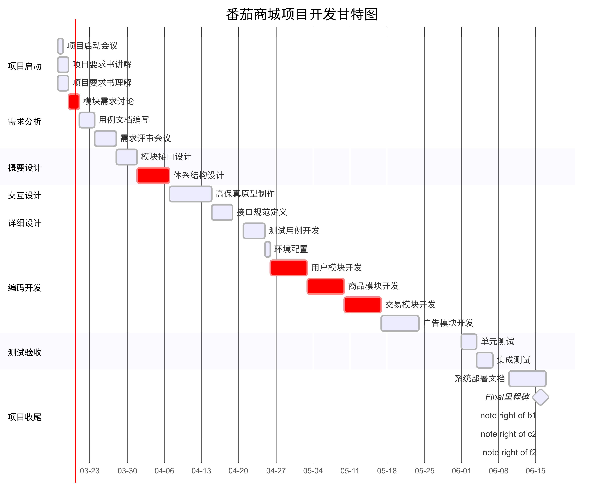

# 番茄商城项目启动文档
**南京大学_软工Ⅱ_第26组_文档Lab1-项目启动文档**  
**最后更新日期**：2025年4月24日

---
[TOC]

---

## 1. 项目名称  
**番茄商城**​（Tomato Book Mall）  

---

## 2. 项目背景  
随着实体书市场的复苏和文化消费升级，番茄读书拟通过线上商城满足以下需求：  
- ​**读者痛点**：线下购书渠道有限，难以快速获取小众书籍  
- ​**市场机遇**：实体书收藏需求增长（2024年纸质书销量同比+15%）  
- ​**战略定位**：打造"阅读+电商"生态闭环，为出版社提供数字化销售渠道  
-	为满足读者对便捷购书、精准推荐和互动体验的需求，同时为出版社提供高效的销售平台，番茄读书的线上商城将提供一个全新的展示与销售渠道，助力优质书籍触达更广泛的读者群体，推动文化市场的繁荣发展。

---

## 3. 项目目标  
### 3.1 核心目标  
- ​**Specific**：实现用户购书全流程（注册→浏览→下单→支付）  
- ​**Measurable**：  
  - 支付成功率 ≥ 99%  
  - 系统响应时间 ≤ 1秒（90%请求）  
- ​**Achievable**：基于Vue3+SpringBoot成熟技术栈开发  
- ​**Relevant**：支持公司"文化消费数字化"战略  
- ​**Time-bound**：2025年6月完成核心功能上线 
- 项目使用前后端分离技术进行开发。前端使用Vue3框架、Vite构建工具，后端使用SpringBoot+JPA框架、MySQL数据库。 共有4次代码Lab、7次文档Lab需要完成，从本学期第5周持续到第16周.
---

## 4. 项目范围  
### 4.1 功能范围  
| ​**模块**       | 功能描述                          |  
|----------------|-----------------------------------|  
| 用户模块       | 顾客信息注册/登录、个人信息管理            |  
| 商品模块       | 货物信息、库存调整（管理员）       |  
| 交易模块       | 交易结算单生成、支付状态变更           |  
| 广告模块       | 首页轮播广告展示，广告信息修改          |  

### 4.2 非功能范围  
- ​**技术框架**：Vue3前端 + SpringBoot后端 + MySQL  
- ​**扩展服务**：物流对接、会员积分体系（后期酌情实现）  

---

## 5. 项目里程碑及时间表  
### 5.1 必选需求时间表  
| 阶段     | 时间范围      | 交付物                          |  
|----------|-------------|---------------------------------|  
| Week5    | 2025/03/17  | 用户模块（登录注册、个人信息管理） |  
| Week6    | 2025/03/24  | 商品模块（CRUD、库存管理）        |  
| Week7    | 2025/03/31  | 交易模块（结算单、支付状态）       |  
| Week8    | 2025/04/07  | 广告模块+补充优化                 |  
| Weeks    | 2025/04     | 待定							  |
 
### 5.2 全流程时间表（含设计与开发并行）

| ​**阶段**         | ​**活动项目**                  | ​**详细内容**                                   | ​**开始日期** | ​**结束日期** |  
|------------------|-----------------------------|---------------------------------------------|------------|------------|  
| ​**1.项目启动**   | 项目启动会议                  | 团队分组、角色分配                             | 2025-03-17 | 2025-03-17 |  
|                  | 项目要求书讲解                | 解读项目范围、技术要求                         | 2025-03-17 | 2025-03-18 |  
|                  | 项目要求书理解                | 需求初步分析、技术栈确认                       | 2025-03-17 | 2025-03-18 |  
| ​**2.需求分析**   | 模块需求讨论                  | 功能拆分（用户/商品/交易模块）                  | 2025-03-19 | 2025-03-20 |  
|                  | 文档编写                      | 形成用例文档、需求规格说明书                    | 2025-03-21 | 2025-03-23 |  
|                  | 需求评审                      | 评审会议、问题记录与修订                        | 2025-03-24 | 2025-03-27 |  
| ​**3.概要设计**   | 模块接口设计                  | 定义用户-商品-交易模块接口                     | 2025-03-28 | 2025-03-31 |  
|                  | 体系结构设计                  | SpringBoot微服务划分、数据库ER图               | 2025-04-01 | 2025-04-06 |  
| ​**4.交互设计**   | 原型设计                      | Figma制作高保真原型（含登录/商品列表/支付流程）  | 2025-04-07 | 2025-04-14 |  
| ​**5.详细设计**   | 函数规格定义                  | 接口参数、返回值、异常处理规范                   | 2025-04-15 | 2025-04-18 |  
|                  | 测试用例编写                  | 覆盖边界条件（如库存为0时下单）                 | 2025-04-21 | 2025-04-24 |  
| ​**6.编码开发**   | 环境搭建                      | Git仓库初始化、CI/CD流水线配置                 | 2025-04-25 | 2025-04-25 |  
|                  | 迭代开发                      | 每周交付一个模块（用户→商品→交易→广告）          | 2025-04-25 | 2025-05-25 |  
| ​**7.测试验收**   | 单元测试                      | JUnit覆盖核心业务逻辑                          | 2025-06-01 | 2025-06-03 |  
|                  | 集成测试                      | Postman验证跨模块交互                          | 2025-06-04 | 2025-06-06 |  
| ​**8.项目收尾**   | 答辩准备                      | 演示材料制作、系统部署文档                      | 2025-06-10 | 2025-06-16 |  

### 5.3 开发模式调整  
- ​**设计与编码并行**：从Week5（3月17日）开始编码，遵循设计与编码并行的原则
- ​**压力分散**：每周同步更新设计文档，团队商讨文档与编码内容

---

## 6. 甘特图  

## 7. 资源与任务分配
### 7.1 团队配置（4人）
| 项目         | 方式                          |
|--------------|-------------------------------|
|​每周例会：|周四下午2：00-4：00
|​文档协作：|github平台实时更新需求文档
|​紧急联络：|重大阻塞问题微信响应
          
### 7.2 关键任务分配
| 时间         | 任务       
|--------------|-------------------------------|
|​Week5：|进行代码框架的搭建以及用户模块的前后端开发
|​Week6：|
|待定		|实时更新

## 8. 人员配置表
|姓名		    | 角色         | 职责                          |
|-------------|--------------|-------------------------------|
|张耀宇		| 前端开发     | Vue3页面开发、交互实现         |
|周林辉		| 前端开发     | Vue3页面开发、交互实现         |
|陈展			| 后端开发     | SpringBoot接口开发、数据库设计 |
|贾亦宸			| 后端开发     | SpringBoot接口开发、数据库设计 | 
